<h1 align="center"></h1>

    
    
    

My name is **RangHo Lee** (and no, that's not my real name), an undergraduate student majoring in **Computer Science and Engineering** and **English Literature and Linguistics** at [Sogang University](https://sogang.ac.kr)! I love learning and trying new things, and of course, building stuff.

Do feel free to reach me out via:

## :raising_hand: More about me! I...
- :globe_with_meridians: ...speak Korean and English *semi-competently* and currently learning German, Japanese and Russian.
- :memo: ...sometimes write articles on **[rangho.postype.com](https://rangho.postype.com)** (in Korean, though).
  - ~~It's not a tech blog; it's more like a trashcan where I stash my gibberish.~~
- :studio_microphone: ...like speaking in public about things I am interested in, such as:
  - [this stuff](https://www.slideshare.net/zu0107/ss-195088497) about Linux customization (Korean),
  - [this stuff](https://www.slideshare.net/zu0107/communism-oop-229741367) about prototype-based object-oriented programming (also Korean),
  - [this stuff](https://www.slideshare.net/zu0107/webassembly-in-a-nutshell) about WebAssembly in general (English),
  - and [this stuff](https://www.slideshare.net/zu0107/rusty-python-229741370) about mixing Rust and Python (also English).
- :sparkles: Fun Fact: ...used to learn Latin in high school and still in love with the language!

## :toolbox: Languages and tools!
Here are the languages I have experience with!

### Languages

### Editors

### Operating systems

## :bar_chart: Some statistics!

    

